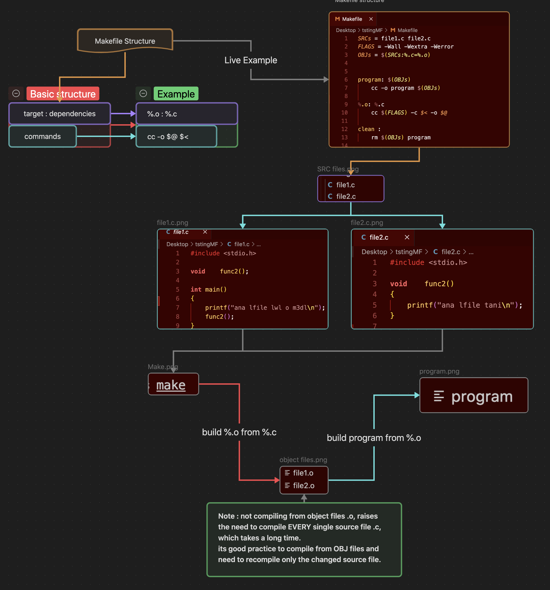

----
#### **Step By step Plan To Make The Libft project**

**- What is Libft :**
A library of most used functions to help in future projects.
  
**- Why Make Libft :**
Programming in C can be a bit tedious sometimes and since in most **1337** projects we can't use\ any of the standard C libraries, and without the access to more useful functions that will make\ life a lot easier, this project aims to provide and replicate some these functions.

**- How to Make Libft :**
To simplify the **“How”** as much as we can : Libft.a.
- Make all the Libc function files *.c that will be in the library.
- Make the header file libft.h that will include all the prototypes declared for the functions, to be included later from (`#include "libft.h"`).
- Make the Makefile to automatically compile and build our library libft.a using the source code from our libc functions.
---

Now into the Detailed guide:

### Makefile :

First order of business comes down to Setting up the Makefile.

 **Notes :**
- Basic Makefile structure :
```make
target: dependencies
commands
```
First target is always the default : rule when you use the command make.

`Target` -> is the file we want to make.\
`Dependencies` -> are the files needed to exist for this target to be made.\
`Commands` : for example like the compile command `gcc -o file.c -o file.o`.

* **Variables :** 

You can declare a variable using the syntax `(=)`.\
Example : `NAME = main / CC = gcc`.\
And call it using the `\$(variable \$(NAME)`.\
Usual variables: `FLAGS - CC - SRC - OBJ - NAME` ...

- **Pattern rules :**

Pattern rules are a powerful way for automation, when creating flexible rules.\
These let you create one 1 rule for many files instead of doing too many rules.

Using the Pattern rules for example `%`:\
`%.o: %.c` means for any target file .o compile it from the same .c file\
`%` matches the file name but unlike `*` Wildcard is that `%` create\
relationships between the specific files, and `*` just match files without connecting them.

- **Automatic variables :**

`$@` : The target name.\
`$<` : The first dependency.\
`$^` : All dependencies.

example :
target : dependency   |  `%.o : %.c`.\
command -o \$\@ \$\<   |  `cc $(FLAGS) -o $@ $<`.

- **Phony targets :**

Adding `.Phony` to a target will prevent Make from confusing the phony target with a file name.
In simple terms, commands and rules that are not meant to conflict with files with the same name.\
for example :\
`clean - all - recompile -fclean ...`.




---
### Libft.h (header file):


The header file in C is used to declare functions and variables, to avoid repeating ready to use functions from The Library   **Libft**   and always having them just by including the header file.
Using : `include "libft.h"`.

example : `libft.h` (we declare here function prototypes later to be used in our src files)
```c
#ifndef LIBFT_H
#define LIBFT_H
int ft_isalpha(int a);
int ft_isdigit(int b);
#endif
```

The header file grabs the declared functions when initiated in a file with `#include "libft.h"`.
this example grabs these source files and uses them like any other function declared within the main file.

**At the end of the day the entire point of a header file is to help make our own Library.**

`ft_isalpha.c`
```c
#include "libft.h" 
int ft_isalpha(int a);
{
//code responsable for this function
}
```
`ft_isdigit.c`
```c
#include "libft.h"
int ft_isdigit(int b)
{
//code responsable for this function
}
```

Note : The header file doesn't contain the actual code, just instructions to find the needed source code.\

---
### The Functions :
Just like during the pool in 1337, here in Libft in order to build our library we need to code a number of functions that will later be helpful throughout our common core.\

---
- **Libc Functions :** 
These include some useual functions from the standard libraries. 
---
- isalpha

**Algorithm to solve the problem**

We simply will have a `condition` to check `if()` the character passed `(int c)`\
is within the range of alphabetical letters in the ascii table `a-z OR A-Z`

if so `return (1);`

else `return (0);`

---
- isdigit

Checks if a character is a **digit** (`0–9`). \
Returns `1` if true, `0` otherwise.

---
- isalnum

Checks if a character is **alphanumeric** (a letter `a–z` or `A–Z` or a digit `0–9`).\
Returns `1` if true, `0` otherwise.\
Basically `isalpha` and `isdigit` combined.

---
- isascii

Checks if a character is part of the **ASCII set** (values `0–127`). \
Returns `1` if true, `0` otherwise.

---
- isprint

Checks if a character is printable, i.e., within the range `32–126`. Returns `1` if true, `0` otherwise.

---
- strlen

Counts characters in a string until the null terminator (`'\0'`) is found. Returns the count.

**Why `size_t`?** \
`size_t` is an **unsigned integer** that adjusts to the largest size possible on the system (e.g., `unsigned long` on 64-bit systems and `unisigned int` in 32 bit systems).

---
- memset

Fill `len` number of bytes of raw memory at `b`.\
Each byte gets the value `(unsigned char)c`.\

**Why unsigned char:** To represent all 256 possible byte values (0–255) without issues from signedness.\
`utilizing (MSB)` most significant bit that is used for signed numbers in 2s compliment.\
Return `b`.\

---
- bzero

- Set `n` bytes of memory at `b` to `0`.\
- Equivalent to `memset(b, 0, n)`.

---
- memcpy

 Copy `n` bytes from `src` to `dest`.\
 No support for overlapping memory. `(research overlap handling in memmove)`\
Return `dest`.

---
- memmove

Copy `n` bytes from `src` to `dest`.\
Safely handles overlapping memory.\
Return `dest`.

---
- strlcpy

Copy `src` to `dst` up to `dstsize - 1`.\
Null-terminate `dst`.\
Return the length of `src`.

---
- strlcat

Append `src` to `dst` up to `dstsize - strlen(dst) - 1`.\
Null-terminate `dst`.\
Return total length of `dst` + `src`.

---
- toupper

If `c` is lowercase, convert to uppercase.\
Otherwise, return `c`.

---
- tolower

If `c` is uppercase, convert to lowercase.\
Otherwise, return `c`.

---
- strchr

Search for the first occurrence of `c` in `s`.\
Return a pointer to it or `NULL` if not found.

---
- strrchr

Search for the Last occurrence of `c` in `s`.\
Return a pointer to it or `NULL` if not found.

---
- strncmp

Compare `s1` and `s2` up to `n` characters.\
Return `0` if equal, `<0` if `s1 < s2`, `>0` if `s1 > s2`.

---
- memchr

Search for byte `c` in the first `n` bytes of `s`.\
Return a pointer to it or `NULL` if not found.

---
- memcmp

Compare the first `n` bytes of `b1` and `b2`.\
Return `0` if equal, `<0` if `b1 < b2`, `>0` if `b1 > b2`.\
basically like strcmp, but comparing the first two differing bytes in raw memory.

---
- strnstr

Search for substring `needle` in `haystack` up to `len`.\
Return a pointer to it or `NULL` if not found.

---
- atoi

Ignore leading spaces.\
Convert numeric characters to an integer.\
Stop at the first non-numeric character.\
Return the integer.

---
malloc usage in these :
- calloc

Use `malloc` to allocate `num * size` bytes of memory.\
Sets all allocated bytes to `0`.\
Returns a pointer to the allocated memory.

---
- strdup

Use `malloc` to allocate memory for a copy of the string (`strlen(s) + 1` bytes).\
Copies the string, including the null terminator, into the allocated memory.\
Returns a pointer to the new string.

---
- **Additional functions :**

Additional non Libc functions:

---
- ft_substr

Extract a substring from `s` starting at index `start`.\
Allocate memory for `len + 1` bytes (null-terminated).\
Copy up to `len` characters.\
Return the new substring.

---
- ft_strjoin

Allocate memory for `s1 + s2 + 1` bytes.\
Copy `s1` into the new string.\
Append `s2`.\
Return the concatenated string.

---
- ft_strtrim

Remove characters from the start and end of `s` that appear in `set`.\
Allocate memory for the trimmed string.\
Copy the trimmed part of `s`.\
Return the new string.

---
- ft_split

Split `s` into substrings using `c` as the delimiter.\
Allocate memory for the list, an array of srtings `Matrix` to the substrings.\
Copy each substring into allocated memory.\
Null-terminate the array.\
If any string failed to allocate, free all the alocated strings and the entire list\
Return the array.

---
- ft_itoa

Convert an integer `n` to its string representation.\
Allocate memory for the string (including space for the sign and null terminator).\
Fill the string with digits (and the sign if negative).\
Return the string.

---
- ft_strmapi

Apply a function `f` to each character of `s`, passing its index and value.\
Allocate memory for the new string.\
Store the result of `f` for each character in the new string.\
Return the new string.

---
- ft_striteri

Apply a function `f` to each character of `s`, passing its index and address.\
Modify `s` in place.\
Return nothing (void).

---
- ft_putchar_fd

Write the character `c` to the file descriptor `fd`.

---
- ft_putstr_fd

Write the string `s` to the file descriptor `fd`.

---
- ft_putendl_fd

Write the string `s` to the file descriptor `fd`.\
and a newline (`\n`).

---
- ft_putnbr_fd

Write the integer `n` as a string to the file descriptor `fd`.\
Handle the sign for negative numbers.\
Write digits one by one.

---
* **Bonus part :**
```
TBD
```

---

### The Library Libft.a :
The library Libft.a simply put is a collection of precompiled code we can reuse in multiple programs.\
After compiling the source files `.c` into object files `.o`, we can combine them into a library
using the command `ar`.

example :
```make
libft.a: $(OBJs)
ar rcs libft.a $(OBJs)
```

what does  `rcs` mean :
`r` - means replace the contents of the library of it already exists.\
`c` - means create the library if it doesn't exist.\
`s` - adds an index to the library to speed up linking. `not needed but good practice`

---

The functions coded
(ghncodi ga3 lfunctions onzidhom for now just till i update everything)

[](https://opensource.org/licenses/MIT)
